# WALMART DATASET EDA

Walmart is a globally recognized retail giant, renowned for offering a wide range of products at competitive prices, and providing a convenient shopping experience for millions of customers worldwide.

Analyzing this dataset offers valuable insights into Walmart's customer base and purchasing behavior. It reveals details about customer demographics, product preferences, and spending patterns.

 This comprehensive dataset is a valuable resource for understanding various aspects of Walmart's operations, such as marketing strategies, customer segmentation, and product demand. It can enhance strategic decision-making in areas like inventory management, targeted marketing, and customer relationship management.

## NOTEBOOK
You can access the jupyter notebook from the files uploaded

## Overview

This analysis provides a comprehensive exploration of the dataset through multiple lenses, each aimed at uncovering actionable business insights. The dataset consists of various demographic attributes, transaction details, and purchase behavior metrics. Our primary objective was to leverage this data to inform key business strategies across several domains, including customer segmentation, product recommendations, and pricing strategies.

#### 1. CUSTOMER SEGMENTATION

```python

age_order = df.copy()['Age'].unique()
age_order.astype(str).sort()

plt.figure(figsize=(10, 7))
ax = sns.histplot(data=df, x='Age', hue='Gender', multiple='stack', palette=walmart_palette)
plt.grid(True, axis='y', linestyle='--', linewidth=0.5)
ax.set_axisbelow(True)
handles = [plt.Rectangle((0, 0), 1, 1, color=color) for color in walmart_palette]
ax.legend(handles, ['Male', 'Female'], title='Gender')
plt.title('Age Distribution by Gender')
plt.xlabel('Age')
plt.ylabel('Counts')

plt.show()
```
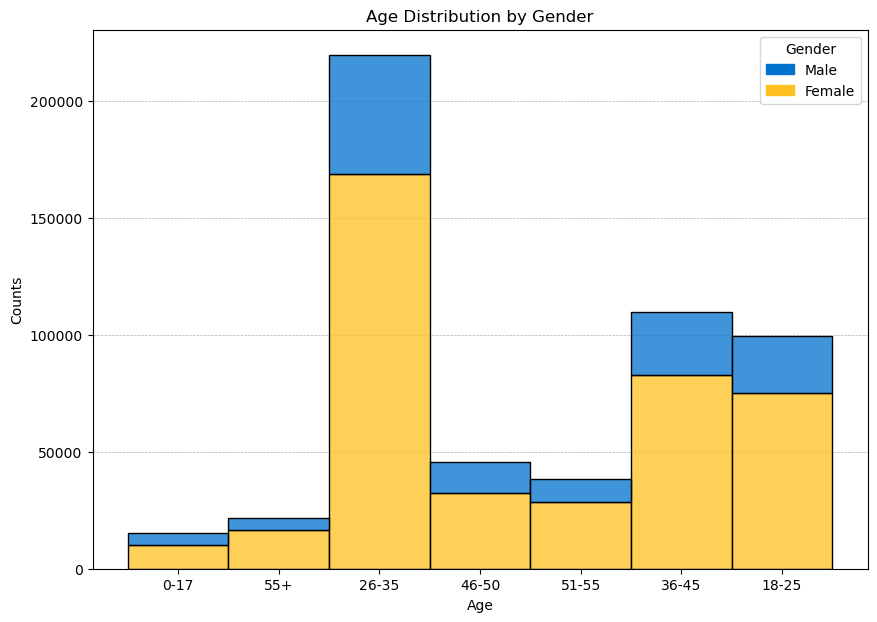

### Analysis

- Dominance of the 26-35 Age Group: This age group is the largest segment, driving most sales, making it crucial to focus marketing and product offerings on their needs.
- Balanced Gender Representation in the 18-25 Age Group: Marketing efforts for this younger demographic should be inclusive and gender-neutral, as both males and females are equally engaged.
- Female-Centric Opportunity in the 36-50 Age Group: Females slightly outnumber males in these age brackets, indicating the potential for tailored marketing and product offerings targeting female shoppers.
- Lower Engagement in 0-17 and 55+ Age Groups: These groups are underrepresented, suggesting an opportunity to introduce targeted products and campaigns to increase engagement.
- Opportunity for Loyalty Programs: Develop loyalty programs with a focus on the 26-35 age group to enhance retention and reward frequent shoppers, driving long-term revenue growth.

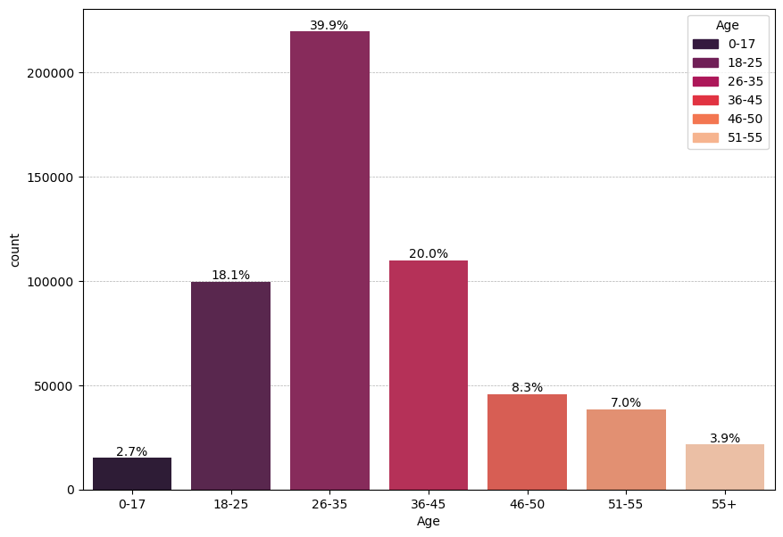

The age distribution analysis highlights the importance of age-specific marketing and product strategies. By focusing on the dominant 26-35 age group while also catering to the needs of other segments, particularly the 36-45 and 18-25 age groups, the business can optimize its marketing efforts, product offerings, and customer engagement strategies to maximize overall sales and customer satisfaction.


#### 2. Product Performance Analysis
```python
top_10_products = df['Product_ID'].value_counts().head(10).index
df_top_products = df[df['Product_ID'].isin(top_10_products)]
plt.figure(figsize=(17, 12))
ax = sns.countplot(x='Product_ID', data=df_top_products, palette='rocket', order=top_10_products)

total = len(df_top_products)
for p in ax.patches:
    percentage =  f'{100 * p.get_height() / total:.1f}%'
    x = p.get_x() + p.get_width() / 2
    y = p.get_height()
    ax.annotate(percentage, (x, y), ha='center', va='bottom')

ax.set_title('Top 10 products')
ax.set_xlabel('Products')
ax.set_ylabel('Count')

colors = [p.get_facecolor() for p in ax.patches]
patches = [mpatches.Patch(color=colors[i], label=product_id) for i, product_id in enumerate(top_10_products)]
ax.legend(handles=patches, title='Top 10 Products')
```
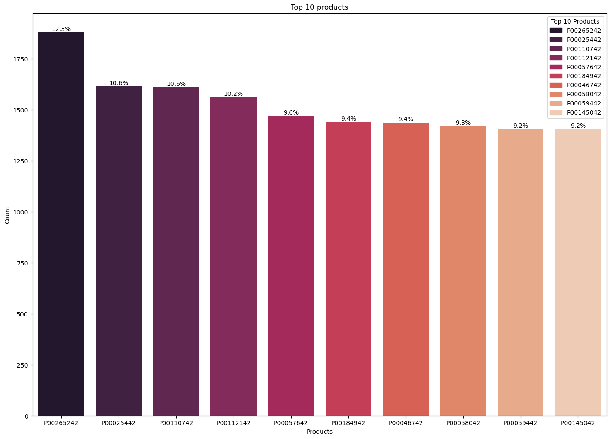

 -	Dominance of Product P00265242: This product is the most popular, accounting for 12.3% of the purchases among the top 10, making it a critical revenue driver.
-	Close Competition Among Top Products: Products P00025442, P00110742, and P00112142 each make up around 10.6% of the top 10 purchases, indicating they are similarly favored by customers.
-	Stable Demand Across Other Top Products: The remaining products have purchase percentages ranging from 9.2% to 10.2%, indicating a balanced and stable demand across these items.
-	Cross-Selling and Bundling Opportunities: The consistent popularity of these products suggests strong potential for cross-selling and bundling strategies to increase average order size.
-	Promotion and Marketing Focus: Featuring these top products in promotions, marketing campaigns, or special offers could leverage their popularity to attract new customers and boost sales further.

The analysis of the top 10 products reveals significant opportunities to enhance business performance through targeted inventory management, cross-selling, bundling, and marketing strategies. By focusing on these popular items, the business can not only ensure consistent revenue streams but also increase customer satisfaction and loyalty.

#### 3. Purchase Amount Analysis

```python
plt.figure(figsize=(12,8))
sns.histplot(data=df['Purchase'],bins=50,kde=True,palette='icefire')
plt.title('Price Amount Distribution')
plt.xlabel('Purchase Amount')
plt.ylabel('Frequency')
plt.tight_layout()
plt.show()
```
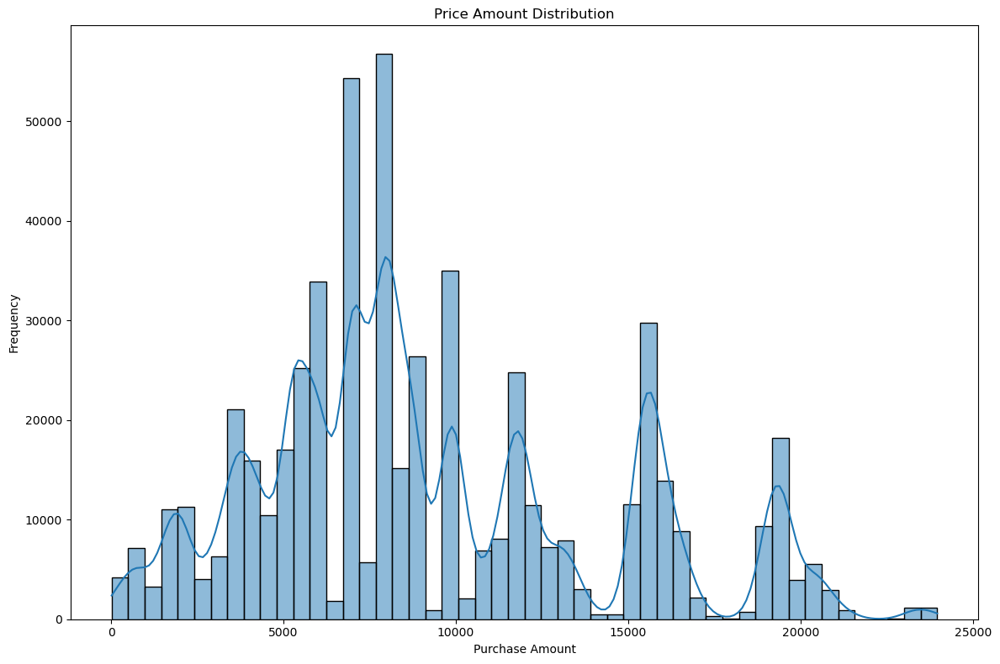

-	Multi-Modal Distribution: The purchase amounts show several peaks, indicating distinct spending segments among customers. This suggests that different groups of customers consistently spend at different levels.
-	Key Price Points at 5,000, 10,000, and 15,000: The most frequent purchase amounts cluster around 5,000, 10,000, and 15,000, highlighting these as critical price points where a large number of transactions occur.
-	Diverse Spending Range: The distribution covers a broad range of purchase amounts, from close to 0 up to 25,000, reflecting a wide variety of customer spending capacities and product price points.
-	Niche Market for High-Value Items: There is a long tail at the higher purchase amounts, although with lower frequency, indicating a smaller but significant market for premium or high-value products.
-	Opportunity for Tiered Pricing Strategies: The distinct modes in the distribution suggest that tiered pricing could be effectively employed to cater to different customer segments, encouraging purchases across various spending levels.

The analysis of purchase amount distribution reveals a diverse customer base with distinct spending behaviors. By aligning product offerings, pricing strategies, and marketing efforts with the identified spending patterns, the business can better meet customer needs and optimize revenue across different customer segments.

#### 4. Gender-Based Spending Analysis
```python
#average purchase per customer

avg_purchse_cust = df.groupby('Gender')['Purchase'].mean()
avg_purchse_cust_df = avg_purchse_cust.reset_index()
avg_purchse_cust_df.columns = ['Gender','Average Purchase Amount']

total_avg_purchase = avg_purchse_cust_df['Average Purchase Amount'].sum()

avg_purchse_cust_df['Percentage'] = avg_purchse_cust_df['Average Purchase Amount']/ total_avg_purchase *100

plt.figure(figsize=(9,10))
ax = sns.barplot(x='Gender',y='Average Purchase Amount',data=avg_purchse_cust_df,palette=walmart_palette)
ax.set_title('Average Purchase Amount by Gender')
ax.set_xlabel('Gender')
ax.set_ylabel('Average Purchase Amount')

for p in ax.patches:
    percentage = (f'${p.get_height():.2f}\n({p.get_height()/total_avg_purchase*100:.1f}%)')
    x = p.get_x() + p.get_width() / 2
    y = p.get_height()
    ax.annotate(percentage, (x, y), ha='center', va='bottom')


colors = [p.get_facecolor() for p in ax.patches]
gender_groups = df.Gender.unique()
patches = [mpatches.Patch(color=colors[i], label=gender) for i, gender in enumerate(gender_groups)]
ax.legend(handles=patches, title='Gender')
```


- Higher Average Purchase by Males: Male customers have a higher average purchase amount, contributing 51.9% of the total, indicating they tend to spend more per transaction compared to female customers.
- Significant Contribution from Females: Female customers, while spending slightly less on average, still contribute a substantial 48.1% to the total purchase amount, underscoring their importance in the overall revenue.
- Close Spending Patterns Between Genders: The difference in average purchase amounts between male and female customers is relatively small, suggesting similar purchasing power and behavior across genders.
- Potential for Gender-Specific Marketing: The data suggests potential for targeted marketing campaigns that cater specifically to the spending habits of each gender, potentially boosting overall sales.
- Balanced Product Offering Strategy: Given the nearly equal contribution from both genders, it’s important to maintain a balanced product offering that appeals to both male and female customers to maximize market reach.

The analysis of average purchase amounts by gender reveals important insights into customer behavior. By recognizing and catering to the slight differences in spending between male and female customers, the business can optimize its marketing and product strategies to increase overall sales and customer satisfaction.

#### 5. Occupation-Based Spending Analysis

```python
occupation_purchase_avg = df.groupby('Occupation')['Purchase'].mean()
occupation_purchase_avg_df = occupation_purchase_avg.reset_index()
occupation_purchase_avg_df.columns = ['Occupation', 'Average Purchase Amount']

plt.figure(figsize=(17, 12))
ax = sns.barplot(x='Occupation', y='Average Purchase Amount', data=occupation_purchase_avg_df, palette='rocket')

# Annotate each bar with the percentage
total = occupation_purchase_avg_df['Average Purchase Amount'].sum()
for p in ax.patches:
    percentage = f'{100 * p.get_height() / total:.1f}%'
    x = p.get_x() + p.get_width() / 2
    y = p.get_height()
    ax.annotate(percentage, (x, y), ha='center', va='bottom')

# Set plot title and labels
ax.set_title('Average Purchase Amount by Occupation')
ax.set_xlabel('Occupation')
ax.set_ylabel('Average Purchase Amount')

plt.show()
```
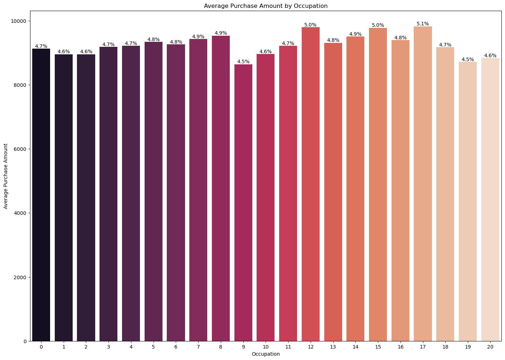

- Highest Average Purchase in Occupation 15: Occupation 15 has the highest average purchase amount, contributing 5.1% to the total, making it a key segment for targeting high-value customers.
- Multiple High-Spending Occupations: Occupations 12, 14, and 15 all contribute around 5% each, indicating several key occupations drive significant revenue.
- Consistent Spending Across Most Occupations: The majority of occupations contribute between 4.5% and 5.1% to the total, showing a relatively even distribution of spending across different job types.
- Lower, Yet Significant, Spending in Some Occupations: Occupations like 10 and 19 have slightly lower contributions (around 4.5%) but still represent important customer segments that shouldn’t be overlooked.
- Need for a Balanced Marketing Strategy: The relatively narrow range in spending contributions suggests a need for a balanced marketing approach that effectively targets all occupations, ensuring broad appeal and maximized revenue.

The occupation-based purchase analysis reveals that while some occupations have higher average purchase amounts, the differences are not extreme. This suggests the need for a balanced marketing strategy that targets high-spending occupations while still addressing the needs of lower-spending ones to maximize overall business performance.

#### 6. Distribution of Purchases Across Demographics and Categories

The boxplots offer valuable insights into how different demographic and categorical factors influence purchasing behavior. By understanding these patterns, businesses can better tailor their marketing strategies, product offerings, and customer engagement efforts to align with the spending habits and preferences of various customer segments.


```python
df.boxplot("Purchase", by = "Occupation")
df.boxplot("Purchase", by = "Marital_Status")
df.boxplot("Purchase", by = "Product_Category")
df.boxplot("Purchase", by = "Stay_In_Current_City_Years")
df.boxplot("Purchase", by = "Gender")
```
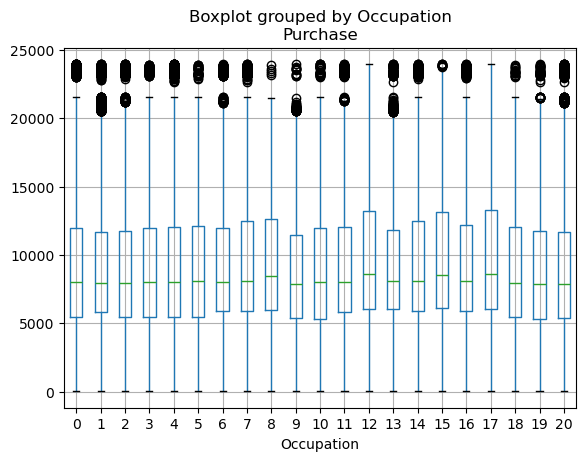
1. Occupation-Based Purchase Distribution:
- Insight: The boxplot for occupation shows a relativ
ely wide range of purchase amounts across different occupations. However, certain occupations exhibit a higher number of outliers, indicating some customers in these groups tend to make significantly larger purchases.

- Implication: Occupations with more outliers or a higher median purchase value could be targeted for premium products or exclusive offers, as they may include higher-spending customers.

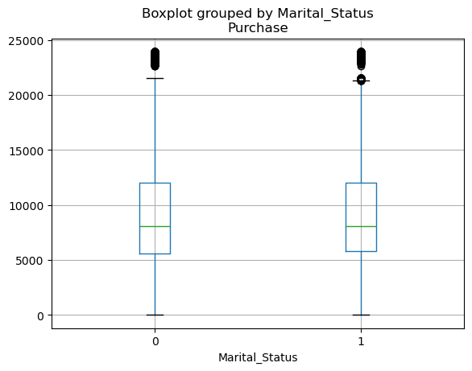
2. Marital Status Impact on Purchases:

- Insight: The boxplot comparing purchase amounts by marital status shows similar distributions between married (1) and unmarried (0) customers, with both groups having a comparable median purchase amount and a similar spread of outliers.

- Implication: Marketing strategies should equally target both married and unmarried customers, as their purchasing behaviors are not significantly different, ensuring inclusivity in promotional campaigns.

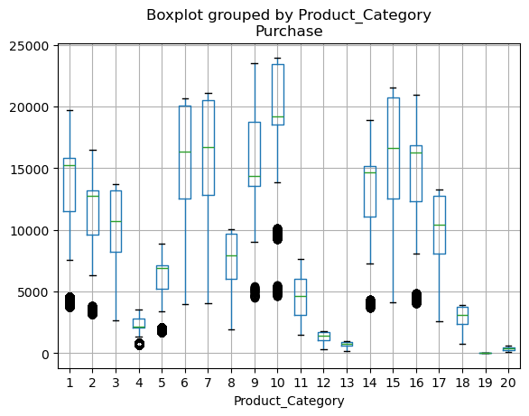

3. Product Category Purchase Patterns:

- Insight: The boxplot for product categories shows that certain categories have a much wider range of purchase amounts and more outliers, indicating that products in these categories are more likely to be higher-value or have more premium options.

- Implication: Focus on product categories with a broader range of purchase amounts for upselling and cross-selling opportunities, particularly those with higher median values and more outliers.

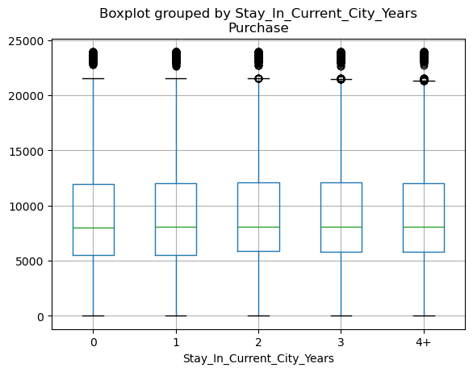

4. Impact of Stay in Current City:

- Insight: The boxplot analyzing the years spent in the current city shows consistent median purchase amounts across all categories, with similar spreads and outliers. This suggests that the length of stay in a city does not significantly impact purchase behavior.

- Implication: Customer retention efforts should not overly focus on the duration of residency, as it does not appear to influence spending patterns. Instead, marketing should be broad-based to appeal to all customers regardless of how long they’ve lived in the city.

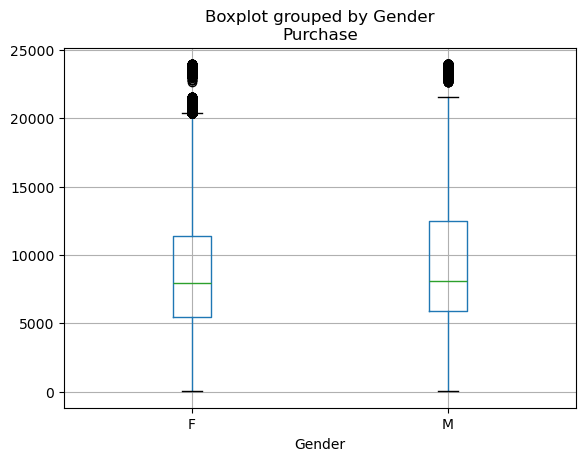

5. Gender-Based Purchase Analysis:

- Insight: The gender-based boxplot reveals that while both genders show similar median purchase amounts, there are slightly more outliers in male customers, indicating a tendency among some males to make larger purchases.

- Implication: While marketing strategies should remain inclusive, consider creating targeted campaigns that cater to male customers who may be inclined towards higher spending, especially for premium products.

#### 7. Age Group Preferences in Product Categories Using Heatmap

```python
fig, ax = plt.subplots(figsize=(12, 8))
cax = ax.matshow(age_product_freq, cmap='viridis')
fig.colorbar(cax)
ax.set_xticks(range(len(age_product_freq.columns)))
ax.set_xticklabels(age_product_freq.columns, rotation=90)
ax.set_yticks(range(len(age_product_freq.index)))
ax.set_yticklabels(age_product_freq.index)
ax.set_title('Product Purchases by Age Group', pad=20)
plt.tight_layout()
plt.show()
```
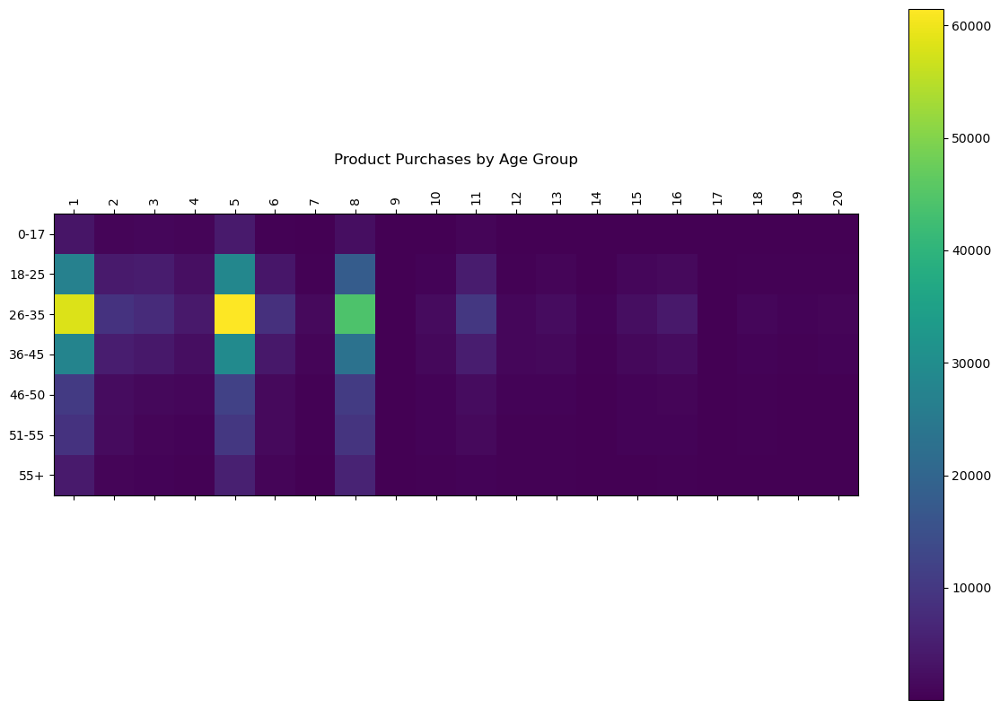

- 26-35 Age Group Dominates Purchases: The 26-35 age group shows the highest purchase frequency across several key product categories, making them the most active shoppers and a critical target for marketing efforts.

- Category-Specific Preferences by Age: Different age groups show distinct preferences for certain product categories, indicating the need for age-specific marketing strategies to maximize engagement and sales.

- Underperforming Product Categories: Some product categories (e.g., 16, 17, 19) have low purchase frequencies across all age groups, suggesting potential issues with product appeal or visibility that need addressing.

- Growth Opportunities in Moderately Popular Categories: Categories like 7, 10, and 13, which show moderate engagement across multiple age groups, represent opportunities for growth through targeted promotions and enhanced visibility.

- Need for a Balanced Marketing Approach: The spread of purchase activity across various age groups and categories suggests that a balanced marketing strategy is necessary to cater to diverse customer preferences and maximize overall sales.


## Recommendations Based on the Analysis

Based on the insights derived from the visualizations, here are targeted recommendations to optimize business strategies:

#### Targeted Marketing Strategies
-  Focus on the 26-35 Age Group: This group is the most active in terms of purchases across multiple product categories. Tailor marketing campaigns and promotions specifically for this age segment, emphasizing products that align with their preferences.

- 	Age-Specific Product Recommendations: Utilize the distinct preferences of different age groups to craft personalized product recommendations. For instance, promote tech gadgets to younger segments and household items or wellness products to older segments.

#### Product and Pricing Strategy

- Leverage Popular Price Points: Capitalize on the key price points identified in the purchase amount distribution (around 5,000, 10,000, and 15,000). Consider offering bundled products or promotions at these price levels to increase average transaction values.

- Revise Product Strategies for Underperforming Categories: Reevaluate the product mix in categories with lower engagement, such as categories 16, 17, and 19. Consider discontinuing low-performing items or introducing new products that align better with customer needs.

#### Enhanced Customer Engagement

- Develop Occupation-Specific Campaigns: Occupations like 15, 12, and 14 exhibit higher spending patterns. Design exclusive offers or loyalty programs targeting these high-value occupations to maximize customer lifetime value.
- Gender-Inclusive Promotions: While spending is relatively balanced between genders, create campaigns that resonate with both male and female customers, ensuring that product selections and marketing messages appeal broadly.

#### Product Portfolio Optimization
- Expand Offerings in High-Growth Categories: Focus on product categories that show growth potential across multiple age groups, such as categories 7, 10, and 13. Increase the visibility of these products through targeted advertising and promotions.

- Enhance Visibility of Niche Products: For product categories with fewer purchases, but with identified niche markets, explore opportunities to boost their visibility through targeted marketing, strategic placement in stores, or featuring them in online marketplaces.

Balanced Resource Allocation 
- Allocate Marketing Budgets Based on Customer Segments: Allocate marketing resources proportionally based on the contribution of different age groups and occupations to the overall revenue. This ensures that high-value segments receive the attention needed to maximize returns.

- Use Insights for Strategic Planning: Incorporate the data-driven insights into broader strategic planning, ensuring that product development, inventory management, and customer relationship management (CRM) are aligned with the preferences and behaviors identified in the analysis.

## CONCLUSION

The comprehensive analysis conducted through various visualizations has provided deep insights into customer behavior, product preferences, and demographic influences on purchasing patterns. Leveraging advanced data visualization techniques, we have unraveled critical patterns that are instrumental in driving informed business decisions.

The analysis has successfully uncovered actionable insights across multiple dimensions of the business, including customer segmentation, product performance, pricing strategy, and demographic influences on purchasing behavior. By employing a range of data visualization techniques, the analysis not only highlighted critical business opportunities but also demonstrated a strong command of data-driven decision-making.

This comprehensive exploration underscores the ability to transform complex datasets into clear, visual narratives that drive strategic business decisions, showcasing expertise in data analysis, visualization, and interpretation. The insights derived from these visualizations provide a roadmap for optimizing marketing efforts, product offerings, and customer engagement strategies, ultimately contributing to enhanced business performance.
